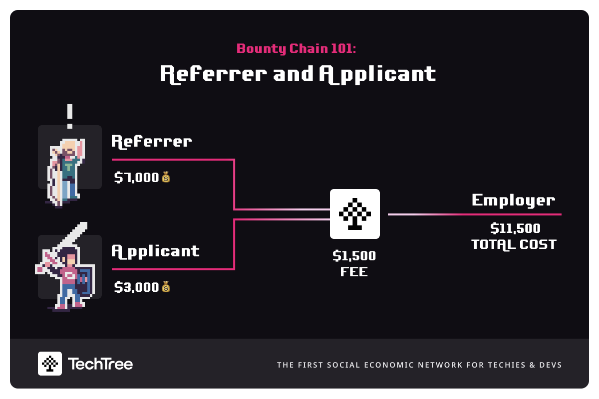
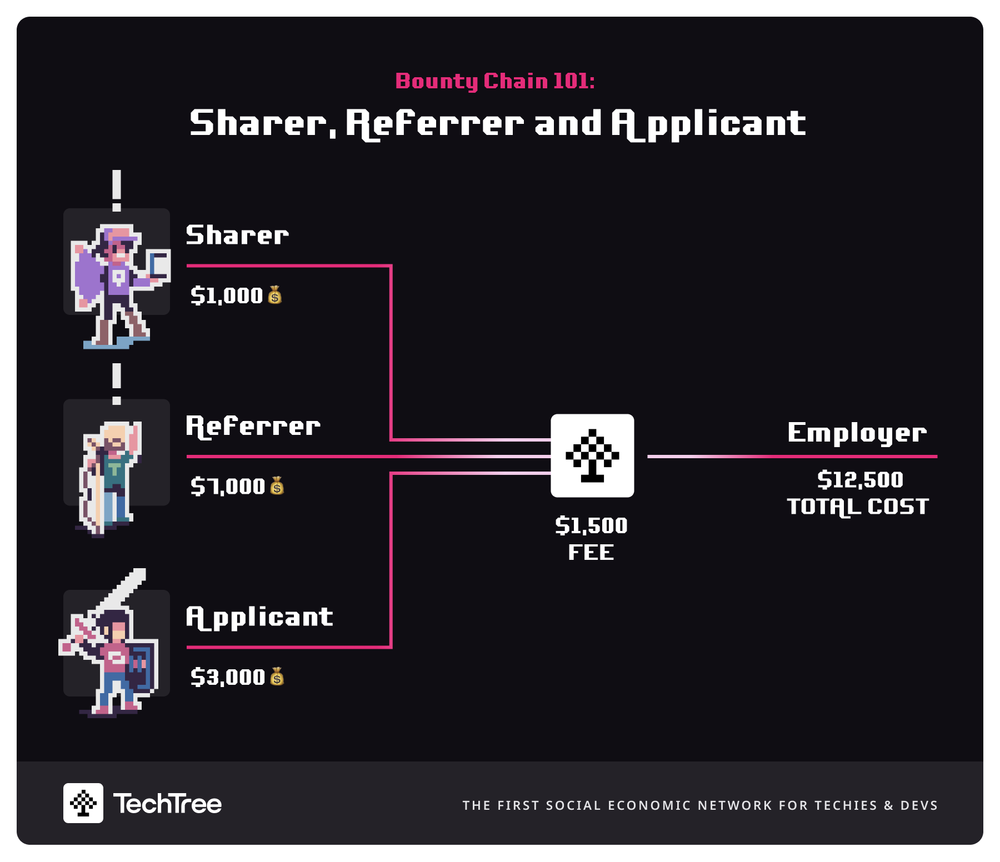
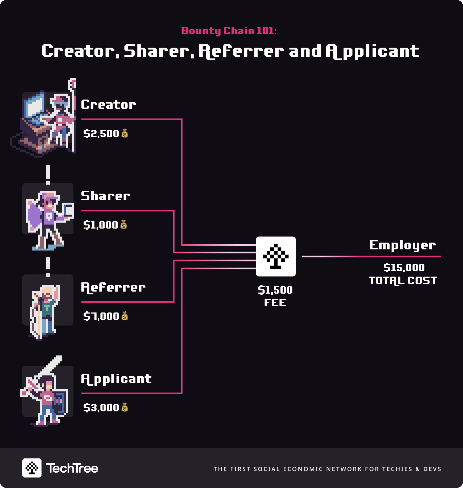

# Examples

.png>)

First, let's remember there are up to 4 [roles ](../roles-at-techtree/)(applicant, referrer, sharer, creator) and up to 4 [types of fees](pricing.md) in the claim chain for a bounty. This depends on the following cases:

### **Case 1 - Referrer and Applicant**

Imagine Alice is on TechTree and sees the Senior Product Design role that the company Wayflyer has posted on the company Bounty Board with a bounty of **$10,000**💰.  Alice thinks that their friend, Bob, would be a great fit for this role. Alice **** sends their friend, Bob, a tracked link for the role. Allice has now become the **Referrer.** Alice also decides to split the bounty 70:30 with Bob if Bob gets hired.

Bob, thinking that he would be a good fit, applies for the job. Bob **** has become an **Applicant**. Let's say you loved how the Bob **** interviews and hire him. After 3 months (90 days) has passed if Bob is still working with Wayflyer, then the amount owed by Wayflyer would be $11,500.

**This is what the transaction should look like:**

| Player           | Fee Category    | Fee    |
| ---------------- | --------------- | ------ |
| Alice (Referrer) | Bounty          | $7,000 |
| Bob (Applicant)  | Bounty          | $3,000 |
| TechTree         | Transaction Fee | $1,500 |

### **Case 2 - Sharer, Referrer and Applicant**

Charlie is looking for a role for himself on Techtree. However, he finds a super interesting role at WayFlyer that could be good for anyone in his network, so he clicks share which generates a personalized and tracked affiliate link for Charlie that points at the role he wants to share. **Charlie** has become a **Sharer**.

Charlie shares the link with his twitter audience and Alice follows it. Alice sees a role at WayFlyer with a $10,000 bounty 💰. Alice knows Wayflyer, and Alice knows her friend Bob (who is a product designer) is looking for a new gig so she refers Bob. **Alice** has become a **Referrer**.&#x20;

Bob receives a referral link from Alice via WhatsApp/email and clicks through to the Wayflyer role on TechTree. **Bob** applies for the role and becomes an **Applicant**.

A short time later, Bob is invited to interview. Bob impresses the WayFlyer team and is hired. After 3 months (90 days) has passed if Bob is still working with Wayflyer, then the amount owed by Wayflyer would be $12,500, as Charlie, the Sharer, will be owed a fee equal to 10% of the bounty.

**This is what the transaction will look like:**

| Player           | Fee Category    | Fee      |
| ---------------- | --------------- | -------- |
| Alice (Referrer) | Bounty          | $7,000   |
| Bob (Applicant)  | Bounty          | $3,000   |
| Charlie (Sharer) | Sharer Fee      | $1,000\* |
| TechTree         | Transaction Fee | $1,500\* |

\*fee is additional to the bounty

### **Case 3 - Creator, Sharer, Referrer and Applicant**

Satoshi Nakamoto joins TechTree and posts an article about cryptography. **Satoshi** has become a **Creator**.

Charlie follows Satoshi and sees his article in his feed. Charlie clicks share which generates a personalized and tracked affiliate link for Charlie that points at Satoshi's article. **Charlie** has become a **Sharer**.

Charlie shares the link with Alice who follows it. Whilst Alice is reading Satoshi's article she sees a role at WayFlyer with a $10,000 bounty 💰. Alice knows Wayflyer, and Alice knows her friend Bob (who is a product designer) is looking for a new gig so she refers Bob. **Alice** has become a **Referrer**.&#x20;

Bob receives a referral link from Alice via WhatsApp and clicks follows it to the Wayflyer role on TechTree. **Bob** applies for the role and becomes an **Applicant**.

A short time later, Bob is invited to interview. Impresses the WayFlyer team and is hired. After 3 months (90 days) has passed if Bob is still working with Wayflyer, then the amount owed by Wayflyer would be $15,000, as Charlie, the Sharer, will receive a reward equal to 10% of the bounty and Satoshi, the Creator, will receive a fee worth 25% of the bounty value.

**This is what the transaction will look like:**

| Player                     | Fee Category    | Fee      |
| -------------------------- | --------------- | -------- |
| Alice (Referrer)           | Bounty          | $7,000   |
| Bob (Applicant)            | Bounty          | $3,000   |
| Charlie (Sharer)           | Sharer Fee      | $1,000\* |
| Satoshi Nakamoto (Creator) | Creator Fee     | $2,500\* |
| TechTree                   | Transaction Fee | $1,500\* |

\*fee is additional to the bounty
