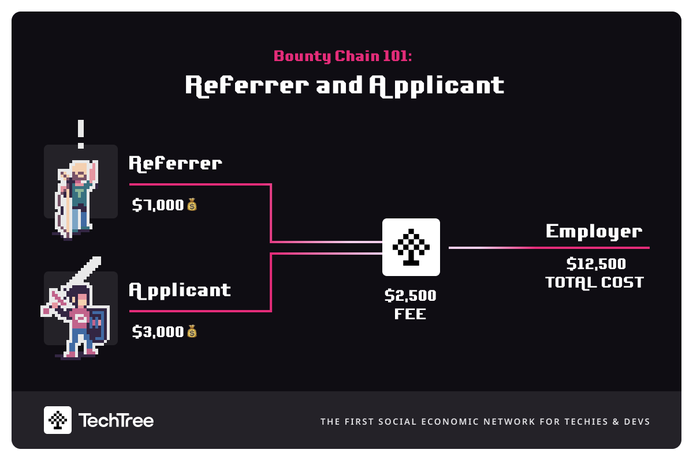

# Pricing for VC Talent Branches

The pricing structure for our VC Talent Branch is comprised of 2 fees:&#x20;

* **Bounty:**

&#x20;The bounty is paid to the referrer and based on the seniority/skill level of the position and is laid out in the table below:

| Seniority/Skill Level | Bounty  |
| --------------------- | ------- |
| Junior-level          | £2,000  |
| Mid-level             | £5,000  |
| Senior-level          | £10,000 |
| C-level               | £15,000 |

* **Transaction fee:**

The transaction fee is paid to TechTree and is 25% of the bounty.

## For Example

Let's say a super talented candidate is referred to your VC talent branch who is a great fit for one of your portfolio companies. The candidate applies and becomes an **Applicant**. This applicant is interviewed for a senior-level position at the portfolio company that carries a £10,000 bounty. The interview process goes well and the candidate is hired. The individual who referred the applicant becomes a **Referrer** and is entitled to the £10,000 bounty. Let us assume the referrer decides to split the bounty 70:30 with the applicant who was hired. The total cost to the portfolio company will look like this:

